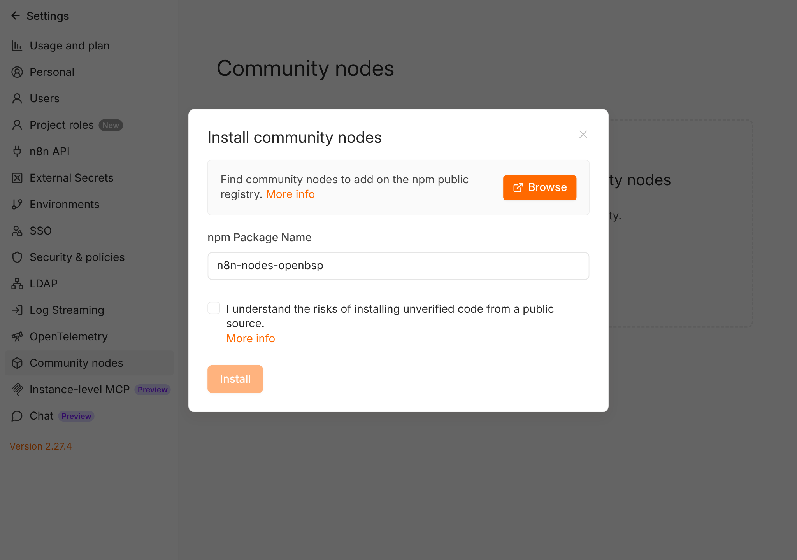
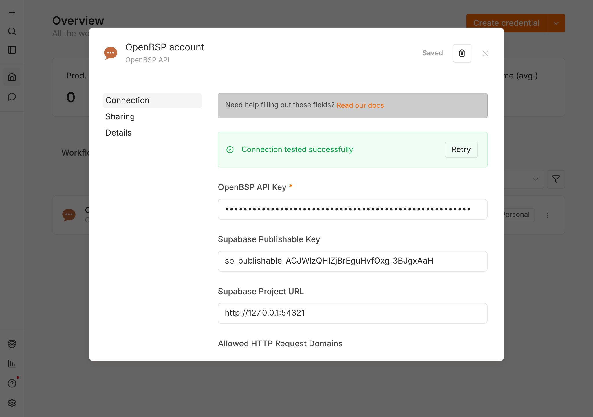
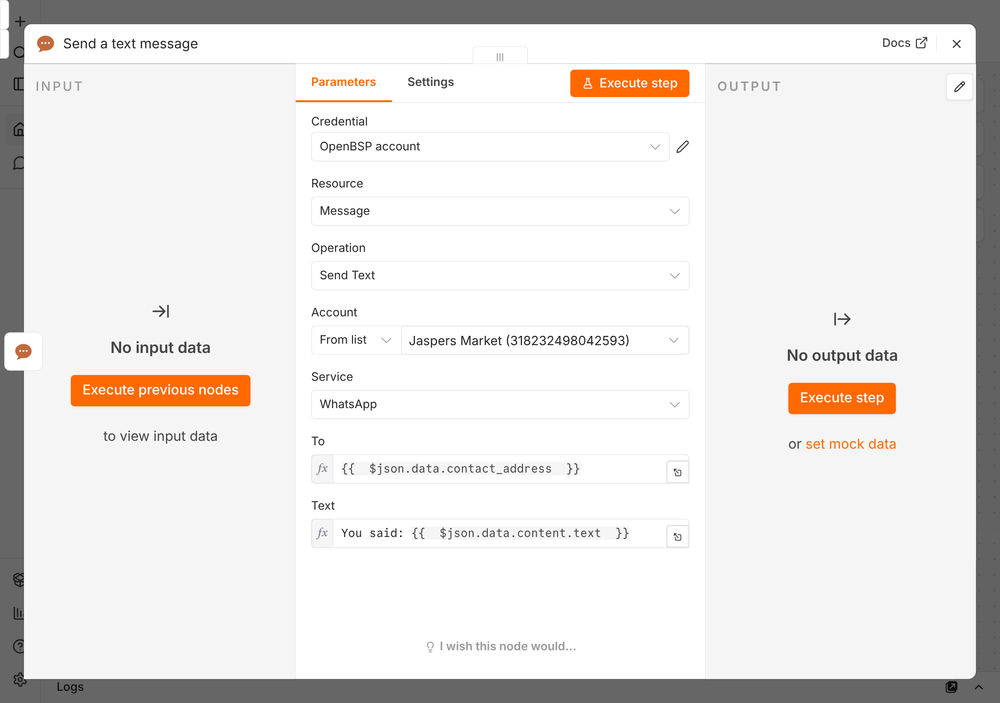
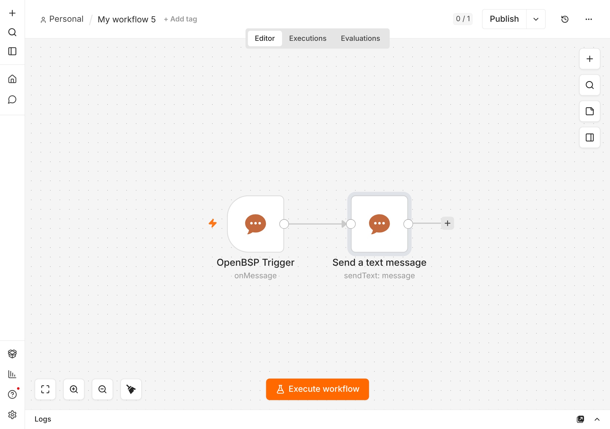
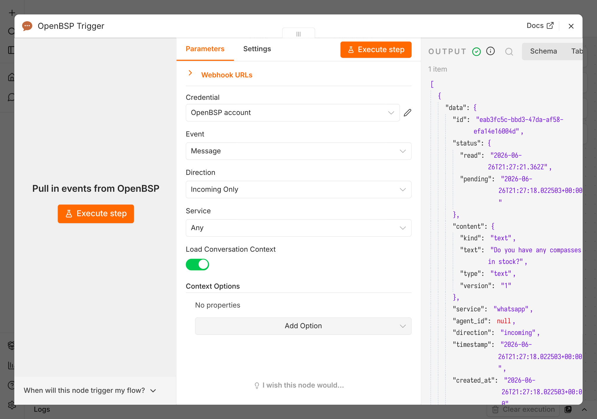
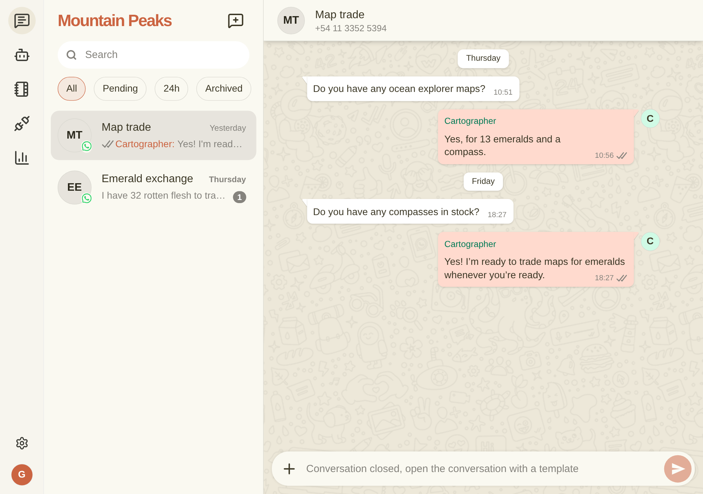

# n8n-nodes-openbsp

n8n community nodes for
[OpenBSP](https://github.com/matiasbattocchia/open-bsp-api), the open-source
WhatsApp and Instagram Business Platform built on Meta's official Cloud API.

Send and receive WhatsApp and Instagram messages from your n8n workflows.
Trigger on incoming messages and delivery-status changes; send text, media,
templates, locations, and contacts; and read conversations, contacts, and
templates.

**Context comes with the message.** Every trigger event (and the **Get Context**
action) can carry the whole conversation: the organization, the contact, and the
recent messages in chronological order. Your AI node replies with full history
and no extra wiring. There is no memory node to configure, no chat-history
database to host, and no contact lookup keyed by phone number.

This package provides two nodes:

- **OpenBSP**: actions organized by resource. **Message** (Send Text / Media /
  Template / Location / Contacts, Get Status, **Get Context**),
  **Conversation**, **Contact**, **Template**, **Account**.
- **OpenBSP Trigger**: starts a workflow on **On Message**, **On Message
  Status**, or **On Conversation** events. It registers and removes the OpenBSP
  webhook for you when the workflow is activated or deactivated, so there is no
  manual webhook setup.

[Installation](#installation) · [Credentials](#credentials) ·
[Quickstart](#quickstart-your-first-workflow) ·
[Example workflows](#example-workflows) · [Get Context](#get-context) ·
[Operations](#operations) · [Development](#development) ·
[Compatibility](#compatibility)

## Installation

In n8n, open **Settings → Community Nodes → Install** and enter
`n8n-nodes-openbsp`. See the n8n
[community nodes guide](https://docs.n8n.io/integrations/community-nodes/installation/).



## Credentials

You need an OpenBSP project with at least one connected WhatsApp or Instagram
number. Use the hosted instance at `web.openbsp.dev`, or self-host from the
[OpenBSP repo](https://github.com/matiasbattocchia/open-bsp-api).

Create one **OpenBSP API** credential:

| Field                        | Notes                                                                       |
| ---------------------------- | --------------------------------------------------------------------------- |
| **OpenBSP API Key**          | OpenBSP UI → Settings → API Keys. Admin role required for the Trigger node. |
| **Supabase Publishable Key** | Pre-filled for the hosted instance. Self-hosters use their own.             |
| **Supabase Project URL**     | Pre-filled for the hosted instance. Self-hosters use their own project URL. |

Hosted-instance users only paste the **API key**; the other two default to
`web.openbsp.dev`. The credential authenticates REST calls with the
`apikey`/`api-key` headers and Edge Function calls with `Authorization: Bearer`
automatically. See
[AUTH.md](https://github.com/matiasbattocchia/open-bsp-api/blob/main/AUTH.md).



## Quickstart: your first workflow

This walkthrough takes you from zero to a working WhatsApp auto-responder. It
assumes you have installed the node and have an OpenBSP API key.

### 1. Add the OpenBSP API credential

In n8n go to **Credentials → New → OpenBSP API**. Paste your **OpenBSP API
Key**. If you use the hosted instance at `web.openbsp.dev`, leave the publishable
key and project URL at their defaults; self-hosters override all three. Click
**Save**, and n8n runs a connection test against your OpenBSP project.

> Use an **Admin** API key if you plan to use the **OpenBSP Trigger**. It needs
> permission to register webhooks.

### 2. Send your first message

1. Create a new workflow and add a **Manual Trigger**.
2. Add an **OpenBSP** node and set:
   - **Resource:** Message
   - **Operation:** Send Text
   - **Account:** pick your sender from the list (your WhatsApp number)
   - **To:** a recipient in international format, digits only (e.g.
     `5491155551234`)
   - **Text:** `Hello from n8n 👋`
3. Click **Execute step**.



> **Service window:** plain text only reaches contacts inside the 24-hour
> customer-service window. To start a brand-new conversation, use **Send
> Template** with an approved template instead.

### 3. Auto-reply to incoming messages (echo bot)

1. Start a new workflow with an **OpenBSP Trigger** node.
   - **Event:** Message
   - **Direction:** Incoming Only
2. Add an **OpenBSP** node (Message → Send Text) connected to the trigger:
   - **Account:** `={{ $json.data.organization_address }}`
   - **To:** `={{ $json.data.contact_address }}`
   - **Service:** `={{ $json.data.service }}`
   - **Text:** `=You said: {{ $json.data.content.text }}`
3. **Activate** the workflow. Activating registers the OpenBSP webhook
   automatically; deactivating removes it.



Send a WhatsApp message to your number, and the workflow echoes it back.



> Your n8n instance must be reachable from the public internet for the trigger
> to receive events. See [Development](#development) for local testing options.

### 4. See it in OpenBSP

Open the OpenBSP web UI. The conversation shows your message and the automated
reply alongside everything else your team handles.



You can also import a ready-made version of these workflows from
[Example workflows](#example-workflows) instead of building them by hand.

## Example workflows

Import via **Workflows → ⋯ (top-right) → Import from File** (or copy the JSON and
paste it onto the canvas). After importing, open each OpenBSP node and select
your **OpenBSP API** credential.

Ready-to-import files live in [`examples/`](examples):

| Workflow      | File                                                         | What it does                                                                                                                                            |
| ------------- | ------------------------------------------------------------ | ------------------------------------------------------------------------------------------------------------------------------------------------------- |
| Echo bot      | [`examples/echo-bot.json`](examples/echo-bot.json)           | Replies to every incoming message with its own text. The smallest end-to-end example.                                                                   |
| AI auto-reply | [`examples/ai-auto-reply.json`](examples/ai-auto-reply.json) | Loads the conversation thread as context and lets an LLM reply with full history, no memory node required. Needs a chat-model credential (e.g. OpenAI). |

<details>
<summary><strong>Echo bot</strong> (JSON)</summary>

```json
{
	"name": "OpenBSP — Echo bot",
	"nodes": [
		{
			"parameters": { "event": "onMessage", "direction": "incoming", "serviceFilter": "any" },
			"name": "On incoming message",
			"type": "n8n-nodes-openbsp.openBspTrigger",
			"typeVersion": 1,
			"position": [380, 300],
			"credentials": { "openBspApi": { "id": "REPLACE_ME", "name": "OpenBSP account" } }
		},
		{
			"parameters": {
				"resource": "message",
				"operation": "sendText",
				"account": {
					"__rl": true,
					"value": "={{ $json.data.organization_address }}",
					"mode": "id"
				},
				"service": "={{ $json.data.service }}",
				"to": "={{ $json.data.contact_address }}",
				"text": "=You said: {{ $json.data.content.text }}"
			},
			"name": "Echo back",
			"type": "n8n-nodes-openbsp.openBsp",
			"typeVersion": 1,
			"position": [680, 300],
			"credentials": { "openBspApi": { "id": "REPLACE_ME", "name": "OpenBSP account" } }
		}
	],
	"connections": {
		"On incoming message": { "main": [[{ "node": "Echo back", "type": "main", "index": 0 }]] }
	}
}
```

</details>

<details>
<summary><strong>AI auto-reply (with conversation context)</strong> (JSON)</summary>

Turn on **Load Conversation Context** in the trigger so the recent thread is
attached to the event. The AI Agent reads that thread straight from
`$json.context.messages` in its system prompt, so no n8n memory node is needed.
Connect any chat model to the AI Agent.

```json
{
	"name": "OpenBSP — AI auto-reply (with context)",
	"nodes": [
		{
			"parameters": {
				"event": "onMessage",
				"direction": "incoming",
				"serviceFilter": "any",
				"loadContext": true
			},
			"name": "On incoming message",
			"type": "n8n-nodes-openbsp.openBspTrigger",
			"typeVersion": 1,
			"position": [340, 320],
			"credentials": { "openBspApi": { "id": "REPLACE_ME", "name": "OpenBSP account" } }
		},
		{
			"parameters": {
				"promptType": "define",
				"text": "={{ $json.data.content.text }}",
				"options": {
					"systemMessage": "=You are a helpful WhatsApp assistant for our business. Keep replies short.\n\nConversation so far (oldest to newest):\n{{ $json.context.messages.map(m => (m.direction === 'incoming' ? 'Customer' : 'Assistant') + ': ' + (m.content && m.content.text ? m.content.text : '[non-text message]')).join('\\n') }}"
				}
			},
			"name": "AI Agent",
			"type": "@n8n/n8n-nodes-langchain.agent",
			"typeVersion": 1.7,
			"position": [640, 320]
		},
		{
			"parameters": { "model": "gpt-4o-mini", "options": {} },
			"name": "OpenAI Chat Model",
			"type": "@n8n/n8n-nodes-langchain.lmChatOpenAi",
			"typeVersion": 1,
			"position": [640, 520],
			"credentials": { "openAiApi": { "id": "REPLACE_ME", "name": "OpenAI account" } }
		},
		{
			"parameters": {
				"resource": "message",
				"operation": "sendText",
				"account": {
					"__rl": true,
					"value": "={{ $('On incoming message').item.json.data.organization_address }}",
					"mode": "id"
				},
				"service": "={{ $('On incoming message').item.json.data.service }}",
				"to": "={{ $('On incoming message').item.json.data.contact_address }}",
				"text": "={{ $json.output }}"
			},
			"name": "Send reply",
			"type": "n8n-nodes-openbsp.openBsp",
			"typeVersion": 1,
			"position": [1000, 320],
			"credentials": { "openBspApi": { "id": "REPLACE_ME", "name": "OpenBSP account" } }
		}
	],
	"connections": {
		"On incoming message": { "main": [[{ "node": "AI Agent", "type": "main", "index": 0 }]] },
		"OpenAI Chat Model": {
			"ai_languageModel": [[{ "node": "AI Agent", "type": "ai_languageModel", "index": 0 }]]
		},
		"AI Agent": { "main": [[{ "node": "Send reply", "type": "main", "index": 0 }]] }
	}
}
```

</details>

## Get Context

Webhooks deliver a single row. The **Message → Get Context** action (and the
trigger's **Load Conversation Context** option) enrich that event with the whole
thread: the organization, the contact, and the recent messages in chronological
order. It is the same shape OpenBSP's `agent-client` builds for an AI agent, so
you can pass it directly to an AI or LLM node.

This is what replaces the usual memory plumbing. Instead of adding a chat-memory
node, keying a session by phone number, and standing up Postgres or Redis to
remember the conversation, you read the thread from a field that is already on
the item.

The trigger emits the changed row under `data`, plus `entity` and `action`. With
context loading on, a `context` object is attached. Here is a real event for an
incoming WhatsApp message, trimmed for readability:

```json
{
	"data": {
		"id": "msg_3f9a",
		"direction": "incoming",
		"conversation_id": "conv_7c2e",
		"organization_address": "552398765432",
		"contact_address": "5491155551234",
		"service": "whatsapp",
		"timestamp": "2026-06-27T14:05:03.000Z",
		"content": {
			"version": "1",
			"type": "text",
			"kind": "text",
			"text": "Great, what time do you close today?"
		}
	},
	"entity": "messages",
	"action": "insert",
	"context": {
		"organization": { "id": "org_1b4d", "extra": { "name": "Acme Café" } },
		"conversation": {
			"id": "conv_7c2e",
			"service": "whatsapp",
			"organization_address": "552398765432",
			"contact_address": "5491155551234"
		},
		"contact": { "name": "María López", "extra": {} },
		"contact_address": { "address": "5491155551234", "extra": {} },
		"messages": [
			{
				"direction": "incoming",
				"timestamp": "2026-06-27T14:02:11.000Z",
				"content": { "type": "text", "kind": "text", "text": "Hi, do you have oat milk?" }
			},
			{
				"direction": "outgoing",
				"timestamp": "2026-06-27T14:02:40.000Z",
				"content": { "type": "text", "kind": "text", "text": "Yes! Oat, almond and soy." }
			},
			{
				"direction": "incoming",
				"timestamp": "2026-06-27T14:05:03.000Z",
				"content": {
					"type": "text",
					"kind": "text",
					"text": "Great, what time do you close today?"
				}
			}
		]
	}
}
```

`context.messages` is the full thread in chronological order (each row also
carries `id`, `conversation_id`, `status`, and `created_at`, trimmed above). The
newest message is both the last entry here and the row under `data`.

### What the AI node receives

The [AI auto-reply](#example-workflows) example folds that thread into the
agent's system prompt with a single expression
(`$json.context.messages.map(...).join('\n')`). For the event above, the model
reads:

```text
You are a helpful WhatsApp assistant for our business. Keep replies short.

Conversation so far (oldest to newest):
Customer: Hi, do you have oat milk?
Assistant: Yes! Oat, almond and soy.
Customer: Great, what time do you close today?
```

The latest message (`Great, what time do you close today?`) is passed separately
as the user input. The history is already on the item, so there is nothing else
to wire up.

That example expression only reads each message's `text`, so text turns and
media **captions** come through, while uncaptioned media, locations, contacts,
and templates collapse to `[non-text message]`. To surface those, branch on
`content.type` and `content.kind` in the expression: a media file lives at
`content.file.uri`, a location at `content.data.latitude` /
`content.data.longitude`, and a template under `content.data.name`.

## Operations

The **OpenBSP** action node, by resource:

| Resource         | Operations                                                                                        |
| ---------------- | ------------------------------------------------------------------------------------------------- |
| **Message**      | Send Text · Send Media · Send Template · Send Location · Send Contacts · Get Status · Get Context |
| **Conversation** | Get · Get Many                                                                                    |
| **Contact**      | Search · Get · Create                                                                             |
| **Template**     | Get Many                                                                                          |
| **Account**      | Get Many                                                                                          |

The **OpenBSP Trigger** fires on **On Message**, **On Message Status**, or **On
Conversation**, with **Direction** (incoming / outgoing / any) and **Service**
(WhatsApp / Instagram / any) filters and an optional **Load Conversation
Context**.

## Development

Requires **Node.js ≥ 22**, Docker, and Git.

```bash
npm install
npm run build      # compile to dist/
npm run lint       # eslint-plugin-n8n-nodes-base (+ n8n community rules)
npm run dev        # run n8n with this node loaded + hot reload (http://localhost:5678)
```

### Testing in a Docker container

`npm run dev` is the fastest loop. To instead test inside the official n8n image,
mount the built package as a custom extension:

```bash
docker volume create n8n_data
npm run build
docker run -it --rm --name n8n -p 5678:5678 \
  -v n8n_data:/home/node/.n8n \
  -v "$(pwd)":/home/node/.n8n/custom/n8n-nodes-openbsp \
  -e N8N_CUSTOM_EXTENSIONS=/home/node/.n8n/custom \
  docker.n8n.io/n8nio/n8n
```

Open http://localhost:5678 and search the node panel for **OpenBSP**.

> **Triggers need a public URL.** Cloud OpenBSP cannot reach `localhost`. Either
> run n8n with a tunnel, or point the credential at a local Supabase stack
> (`npx supabase start`). The action node needs neither.

## Compatibility

- n8n nodes API version 1; Node.js ≥ 22.
- OpenBSP runs on Meta's official Cloud API: no QR or session to manage; messages
  outside the 24-hour service window require an approved **template**; groups and
  status broadcasts are not available.

## Resources

- [OpenBSP repo](https://github.com/matiasbattocchia/open-bsp-api)
- [n8n community nodes docs](https://docs.n8n.io/integrations/community-nodes/)

## License

[MIT](LICENSE)
